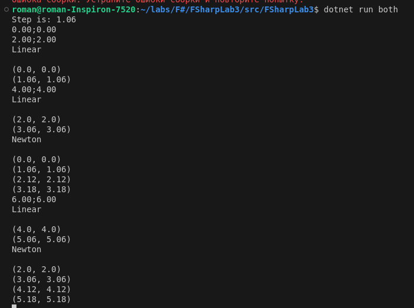
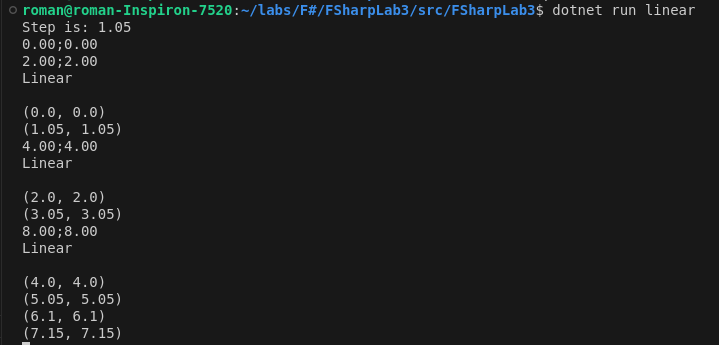

# FSharpLab3
### Юнусов Роман Ильдарович

## Реализация интерполяции через линейный метод

```f#
let linearInterpolationFunc (x0: float) (y0: float) (x1: float) (y1: float) (x: float) =
    y0 * (x1 - x) / (x1 - x0) + y1 * (x - x0) / (x1 - x0)

let prepareXY (x: seq<float>) (y: seq<float>) =
    let xy = Seq.zip x y
    Seq.pairwise xy

let rec doInterpolation xyPairs currentStep incStep =
    match Seq.tryHead xyPairs with
    | None -> Seq.empty
    | Some((x0, y0), (x1, y1)) ->
        let newY = linearInterpolationFunc x0 y0 x1 y1 currentStep
        let resultSeq = seq { yield (currentStep, newY) }

        if currentStep >= x0 && currentStep <= x1 then
            Seq.append resultSeq (doInterpolation xyPairs (currentStep + incStep) incStep)
        else
            Seq.append resultSeq (doInterpolation (Seq.tail xyPairs) currentStep incStep)

let linearInterpolation xy (currentStep: float) (incStep: float) =
    doInterpolation (Seq.pairwise xy) currentStep incStep
```

## Реализация интерполяции через ньютоновский метод.

```f#
let swapFirstAndLast seq =
    Seq.append (Seq.tail seq) (Seq.singleton (Seq.head seq))

let ignoreLast seq =
    Seq.take (Seq.length seq - 1) seq

let rec calculateDown xy (currentX: float) =
    match Seq.length xy with
    | 1 -> (currentX - fst (Seq.head xy))
    | _ -> (currentX - fst (Seq.head xy)) * (calculateDown (Seq.tail xy) currentX)

let rec calculateCoefficients xy repeats : float =
    match repeats with
    | 1 -> (snd (Seq.head xy)) / (calculateDown (Seq.tail xy) (fst (Seq.head xy)))
    | _ ->
        let currentCoefficient = (snd (Seq.head xy)) / (calculateDown (Seq.tail xy) (fst (Seq.head xy)))
        currentCoefficient + calculateCoefficients (swapFirstAndLast xy) (repeats - 1)

let rec calculateXFunction (xy: seq<float * float>) currentX =
    match Seq.length xy with
    | 1 -> (currentX - fst (Seq.last xy))
    | _ -> (currentX - fst (Seq.last xy)) * (calculateXFunction (ignoreLast xy) currentX)

let rec newtonInterpolationValue xy currentX =
    match Seq.length xy with
    | 1 -> snd (Seq.head xy)
    | _ ->
        let currentCoefficient = calculateCoefficients xy (Seq.length xy)
        let currentXFunction = calculateXFunction (ignoreLast xy) currentX
        currentCoefficient * currentXFunction + newtonInterpolationValue (ignoreLast xy) currentX

let rec newtonInterpolationSequence xy currentStep stepIncrement =
    if currentStep < fst (Seq.last xy) then
        let nextValue = newtonInterpolationSequence xy (currentStep + stepIncrement) stepIncrement
        let currentValue = seq { yield currentStep, newtonInterpolationValue xy currentStep }
        Seq.append currentValue nextValue
    else
        seq { yield currentStep, newtonInterpolationValue xy currentStep }

```
## Основной модуль
Основная суть mainа будет в этих двух функциях.
Первая просто запускает функцию интерполяции с нужными шагом на имеющейся последовательности точек.
Вторая читает каждый шаг новую точку, и запускает первую, обновляя последовательность.

```f#
let calculateAndPrint approxName someSeq step approx =
    let result = approx someSeq (fst (Seq.head someSeq)) step
    printfn "%s\n" approxName

    for pair in result do
        printfn "%A" pair

let rec doWhileRecursively (states: seq<ApproxState>) =
    for state in states do
        calculateAndPrint state.Name state.Points state.Step state.Func

    let newPoint = readPoint ()

    let newStates =
        seq {
            for state in states do
                yield
                    { state with
                        Points = (seqAdd (Seq.tail state.Points) (newPoint)) }
        }

    doWhileRecursively newStates
```

## Демонстрация работы

В качестве аргумента можно выбирать сколько методов использовать.
Интерполяция обеих видов


Линейная интерполяция
